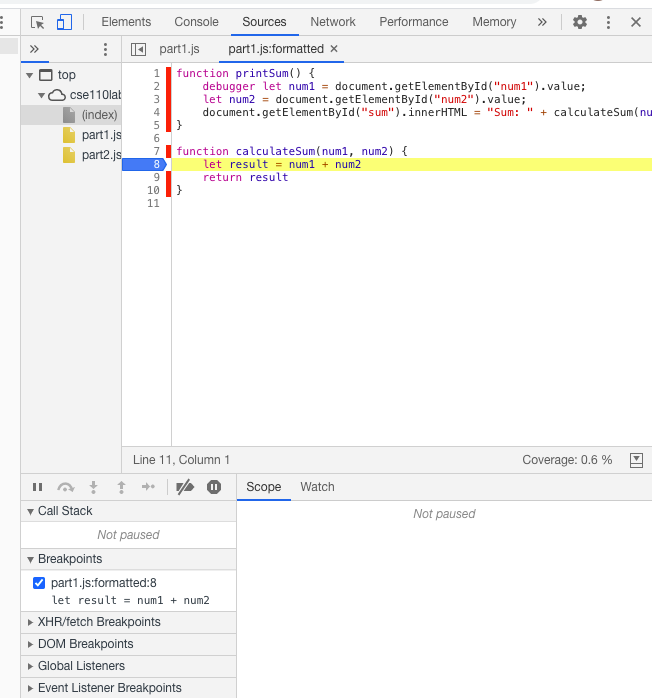
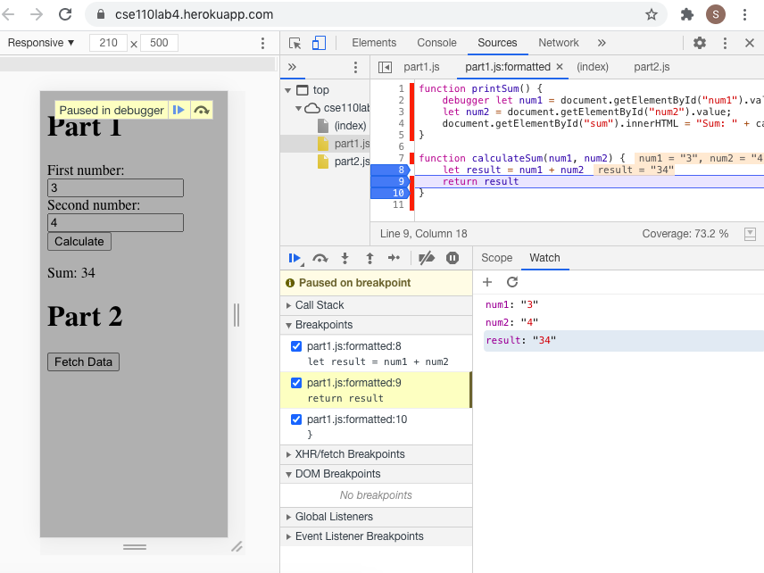

***

***
1. What was the bug?
* The id `num1` and `num2` were not given the specific type so the default type of `text`was used.
2. How would you fix it? Include the screenshot of your fix.
* 

***
1. What is the name of the new json file?
* `citylots.json`
2. Which file initiated the download of the new file?
`index.html: 21`
3. What is its file size?
`11.7 MB
4. How long did it take to download?
`1.35 s`
***
Next, select that file to bring up a new side panel to answer the following:
5. What was your User-Agent for the browser that made the request?
* `Mozilla/5.0 (Linux; Android 6.0; Nexus 5 Build/MRA58N) AppleWebKit/537.36 (KHTML, like Gecko) Chrome/88.0.4324.96 Mobile Safari/537.36`
6. In the response, what type of server did it come from?
* `Apache`
7. When was the file last modified?
`Tue, 26 Jan 2021 22:14:13 GMT`
8. What was the Content-Type of the file?
* `application/json`
***
Navigate to the Initiator tab now and answer the last question
9. Which method inside the initiating file made the request?
`fetch`
